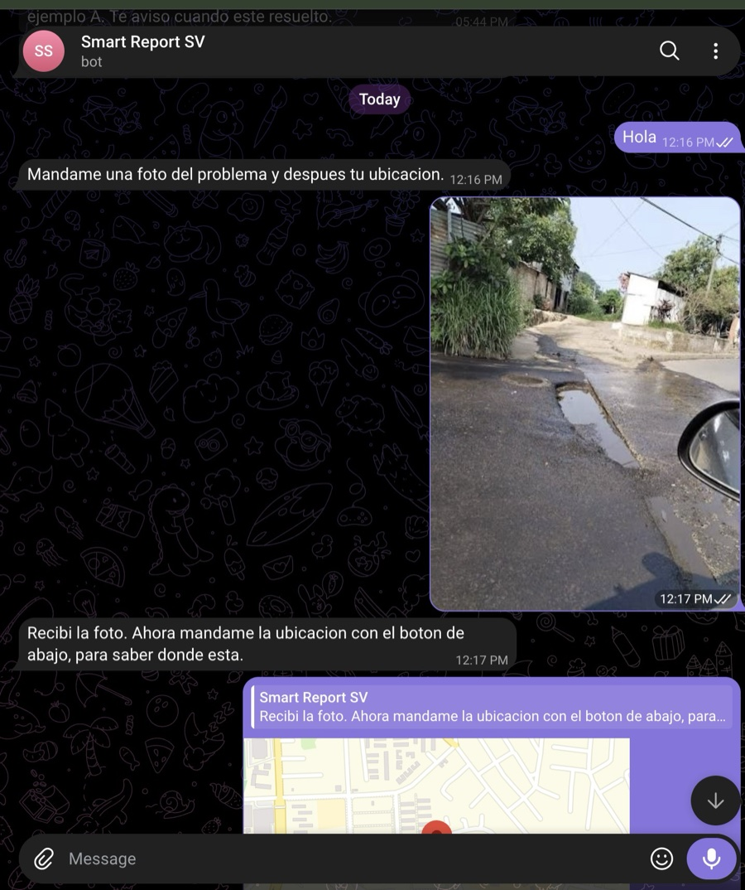
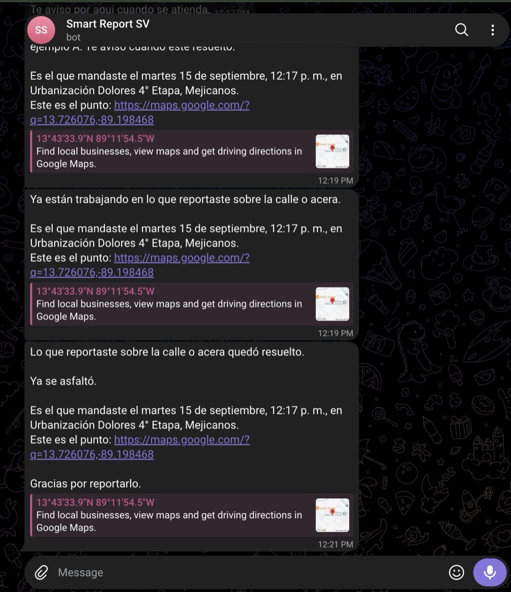

# Smart Report IA

Sistema de reportes ciudadanos de hallazgos en la vía pública de El Salvador.
Alguien ve un hueco en la calle, le manda una foto a un bot de Telegram, y la
cuadrilla lo ve agrupado con los otros tres que reportaron lo mismo.

Hay dos personas con necesidades opuestas. **Quien reporta** está parado frente
al problema, con prisa, y tiene que poder reportar en menos de un minuto sin
instalar nada. **Quien despacha** mira el sistema ocho horas, y su problema no
es recibir reportes sino saber cuáles son el mismo. El sistema existe para la
segunda; la primera es el sensor.

El alcance, las fases y las decisiones ya tomadas están en [`PLAN.md`](PLAN.md).

---

## Qué hace

```
 foto + ubicación        el modelo propone          el código decide
 por Telegram      →     categoría y urgencia   →   si es el mismo caso   →  cuadrilla
      ↑                  (la persona confirma)      (distancia y foto)         │
      └──────────────  aviso de vuelta a todos los que reportaron  ───────────┘
```

El principio que sostiene todo: **el modelo propone, el código decide, y lo que
no se puede sostener se informa.** El modelo clasifica y sugiere; no asigna
cuadrillas ni cierra casos. La agrupación la decide código con umbrales
medidos, muestra su evidencia y se puede deshacer. Lo que queda en el límite se
marca como dudoso, con el motivo, esperando a una persona.

## Cómo se ve

### Para quien reporta

Un hueco anegado en Mejicanos. Foto, ubicación por el botón nativo de Telegram,
y listo: menos de un minuto, sin instalar nada.



Y lo que casi nadie construye: **el aviso de vuelta**, a todos los que
reportaron y no solo al primero. Cada mensaje dice cuál de sus reportes es
—cuándo lo mandó y dónde— porque la categoría sola no lo distingue.



### Para quien despacha

El tablero, con datos reales del mismo reporte.


Un caso abierto: la foto de quien reportó, la dirección resuelta, y el panel de
despacho —que no deja cerrar sin foto del arreglo, porque un cierre sin
evidencia es una afirmación que nadie puede comprobar.


El mapa. El tamaño del pin dice cuántas personas reportan lo mismo: un mapa de
puntos iguales tira a la basura justo la información que importa.


> Las del tablero se regeneran con `cd frontend && DEMO_PASSWORD=… node
> scripts/capturas.mjs`, contra lo que haya en la base. No inventan datos.

## Estado

| Fase | | |
|---|---|---|
| 0 · Esqueleto | cerrada | |
| 1 · El canal | cerrada | webhook, límites, cero llamadas salientes |
| 2 · Almacenamiento | cerrada | miniaturas, huella perceptual, retención |
| 3 · Clasificación | **abierta** | falta la muestra de 200 fotos etiquetadas |
| 4 · Agrupación | **abierta** | faltan 200 reportes agrupados a mano |
| 5 · El tablero | **abierta** | falta que alguien que no lo vio lo entienda solo |
| 6 · Despacho y cierre | cerrada | ciclo real completo, de la foto al aviso de cerrado |
| 7 · Tiempo real y E2E | cerrada | SSE sobre `LISTEN/NOTIFY`, 9 recorridos en CI |
| 8 · Despliegue | escrita | corre en local; falta ponerla en un servidor |

Las fases abiertas lo están porque **sus verificaciones piden datos que todavía
no existen**, no porque falte código: el que las mide está escrito y avisa
cuando la muestra no alcanza en vez de dar un número. Una fase sin verificación
es una fase que alguien cree que terminó.

---

## Con qué está hecho

| | |
|---|---|
| **Backend** | FastAPI · SQLAlchemy 2 · Alembic · Python 3.13 |
| **Base** | PostgreSQL 17 con PostGIS 3.5 — también hace de cola y de bus de eventos |
| **Modelo** | Anthropic `claude-haiku-4-5`, con salida por esquema |
| **Canal** | python-telegram-bot, usado como **biblioteca y no como framework** |
| **Almacenamiento** | S3-compatible: MinIO en local, R2 al desplegar |
| **Tablero** | Next.js 16 · shadcn/ui · MapLibre · TanStack Query |
| **Pruebas** | pytest y Playwright contra el sistema levantado |

Sin Redis y sin bus de mensajes: la cola es una tabla con `FOR UPDATE SKIP
LOCKED` y los avisos al tablero salen de `LISTEN/NOTIFY`. Un segundo almacén es
infraestructura que hay que desplegar, vigilar y explicar; cuando el volumen lo
justifique, se cambia el adaptador.

## Arrancar

```bash
cp .env.example .env      # poner ANTHROPIC_API_KEY
make up
make seed
```

| | |
|---|---|
| API | http://localhost:8000/health |
| Docs | http://localhost:8000/docs |
| Web | http://localhost:3100 |
| MinIO | http://localhost:9001 |
| Postgres | `localhost:5433` (no 5432) |

`make up` levanta Postgres con PostGIS, MinIO, corre las migraciones y sirve
API y frontend. La primera vez tarda: construye las imágenes. `make seed`
deja sembrados los canales conocidos y se puede correr las veces que sea.

## Comandos

| | |
|---|---|
| `make test` | pytest contra la base levantada |
| `make lint` | ruff, ESLint y `tsc --noEmit` |
| `make e2e` | los nueve recorridos contra el sistema levantado |
| `make tunnel` | túnel HTTPS y registro del webhook en Telegram |
| `make health` | `/health` formateado |
| `make nuke` | baja todo y borra los datos |

Hay más —migraciones, siembra, retención, y los que **miden**: `make bench`
para el costo por foto, `make accuracy` para la exactitud, `make grouping-eval`
para las dos tasas de agrupación—. `make help` los lista todos.

## Cómo funciona por dentro

El diseño, y lo que cada decisión costó descubrir, está en
[`docs/DISENO.md`](docs/DISENO.md): el webhook sin llamadas de red salientes, la
cola que vive en Postgres, por qué la huella de una foto **no** fuerza una
agrupación, y la asimetría que calibra los umbrales —separar dos reportes que
eran el mismo caso es molesto; juntar dos problemas distintos esconde uno.

## Desplegar

Hoy corre en local. El material para ponerlo en un servidor está escrito y
probado —imágenes de producción, compose con Caddy, respaldo diario y retención
como servicio— en [`DESPLIEGUE.md`](DESPLIEGUE.md).

Todo el software del despliegue es gratuito y permanente. El **único costo real
del sistema es el modelo**: USD 0,0018 por foto.

## Métricas

Las cuatro que definen si el proyecto sirve. Se llenan con el número medido,
nunca con una promesa.

| Qué | Valor | Fase |
|---|---|---|
| Exactitud de clasificación | pendiente de etiquetas | 3 |
| Costo de clasificación por foto | **USD 0,0018** | 3 |
| Agrupaciones incorrectas (falsos positivos) | — | 4 |
| Agrupaciones perdidas (falsos negativos) | — | 4 |
| Costo de almacenamiento por foto | **USD 0,0000201** (n=1) | 2 |
| Costo por reporte | — | 8 |

## Convenciones

Identificadores, cadenas y mensajes de commit en inglés. Comentarios y
docstrings en español. Commits en formato Conventional Commits.
