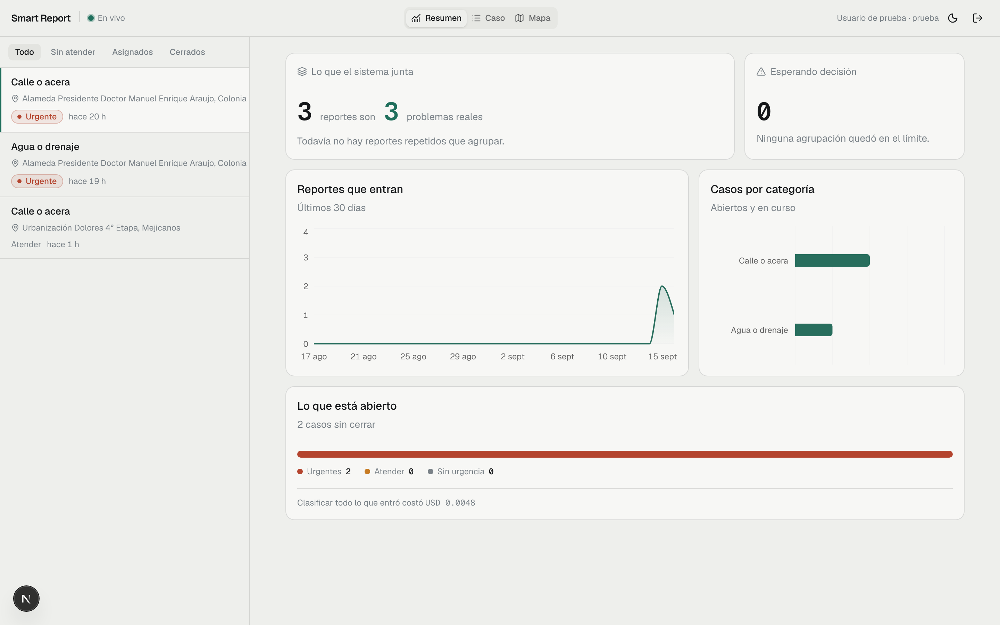
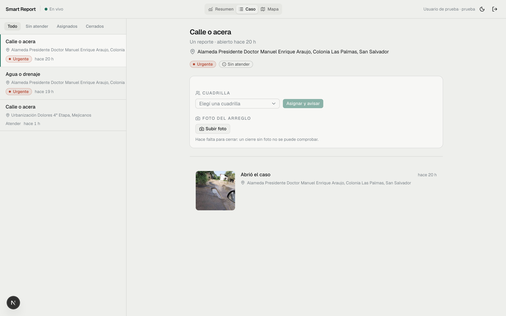
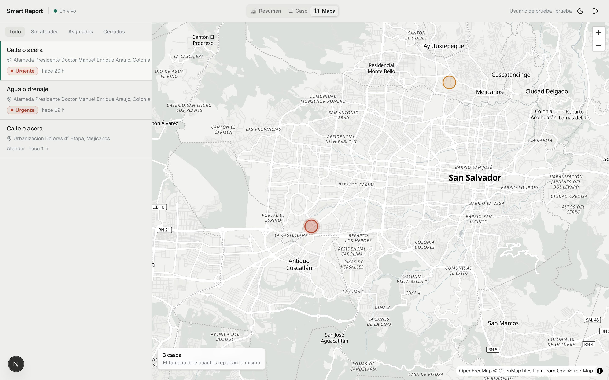

# Smart Report IA

Sistema de reportes ciudadanos de hallazgos en la vía pública de El Salvador.
Alguien ve un hueco en la calle, le manda una foto a un bot de Telegram, y la
cuadrilla lo ve agrupado con los otros tres que reportaron lo mismo.

Hay dos personas con necesidades opuestas. **Quien reporta** está parado frente
al problema, con prisa, y tiene que poder reportar en menos de un minuto sin
instalar nada. **Quien despacha** mira el sistema ocho horas, y su problema no
es recibir reportes sino saber cuáles son el mismo. El sistema existe para la
segunda; la primera es el sensor.

El alcance, las fases y las decisiones ya tomadas están en [`PLAN.md`](PLAN.md).

---

## Qué hace

```
 foto + ubicación        el modelo propone          el código decide
 por Telegram      →     categoría y urgencia   →   si es el mismo caso   →  cuadrilla
      ↑                  (la persona confirma)      (distancia y foto)         │
      └──────────────  aviso de vuelta a todos los que reportaron  ───────────┘
```

El principio que sostiene todo: **el modelo propone, el código decide, y lo que
no se puede sostener se informa.** El modelo clasifica y sugiere; no asigna
cuadrillas ni cierra casos. La agrupación la decide código con umbrales
medidos, muestra su evidencia y se puede deshacer. Lo que queda en el límite se
marca como dudoso, con el motivo, esperando a una persona.

## Cómo se ve

El tablero, con datos reales de un reporte mandado desde un teléfono.



Un caso abierto: la foto de quien reportó, la dirección resuelta, y el panel de
despacho —que no deja cerrar sin foto del arreglo, porque un cierre sin
evidencia es una afirmación que nadie puede comprobar.



El mapa. El tamaño del pin dice cuántas personas reportan lo mismo: un mapa de
puntos iguales tira a la basura justo la información que importa.



> Las capturas se regeneran con `cd frontend && DEMO_PASSWORD=… node scripts/capturas.mjs`,
> contra lo que haya en la base. No inventan datos.

## Estado

| Fase | | |
|---|---|---|
| 0 · Esqueleto | cerrada | |
| 1 · El canal | cerrada | webhook, límites, cero llamadas salientes |
| 2 · Almacenamiento | cerrada | miniaturas, huella perceptual, retención |
| 3 · Clasificación | **abierta** | falta la muestra de 200 fotos etiquetadas |
| 4 · Agrupación | **abierta** | faltan 200 reportes agrupados a mano |
| 5 · El tablero | **abierta** | falta que alguien que no lo vio lo entienda solo |
| 6 · Despacho y cierre | **abierta** | hecho el ciclo real; falta repetirlo hasta el cierre |
| 7 · Tiempo real y E2E | cerrada | SSE sobre `LISTEN/NOTIFY`, 9 recorridos en CI |
| 8 · Despliegue | escrita | corre en local; falta ponerla en un servidor |

Las fases abiertas lo están porque **sus verificaciones piden datos que todavía
no existen**, no porque falte código: el que las mide está escrito y avisa
cuando la muestra no alcanza en vez de dar un número. Una fase sin verificación
es una fase que alguien cree que terminó.

---

## Con qué está hecho

| | |
|---|---|
| **Backend** | FastAPI · SQLAlchemy 2 · Alembic · Python 3.13 |
| **Base** | PostgreSQL 17 con PostGIS 3.5 — también hace de cola y de bus de eventos |
| **Modelo** | Anthropic `claude-haiku-4-5`, con salida por esquema |
| **Canal** | python-telegram-bot, usado como **biblioteca y no como framework** |
| **Almacenamiento** | S3-compatible: MinIO en local, R2 al desplegar |
| **Tablero** | Next.js 16 · shadcn/ui · MapLibre · TanStack Query |
| **Pruebas** | pytest y Playwright contra el sistema levantado |

Sin Redis y sin bus de mensajes: la cola es una tabla con `FOR UPDATE SKIP
LOCKED` y los avisos al tablero salen de `LISTEN/NOTIFY`. Un segundo almacén es
infraestructura que hay que desplegar, vigilar y explicar; cuando el volumen lo
justifique, se cambia el adaptador.

## Arrancar

```bash
cp .env.example .env      # poner ANTHROPIC_API_KEY
make up
make seed
```

| | |
|---|---|
| API | http://localhost:8000/health |
| Docs | http://localhost:8000/docs |
| Web | http://localhost:3100 |
| MinIO | http://localhost:9001 |
| Postgres | `localhost:5433` (no 5432) |

`make up` levanta Postgres con PostGIS, MinIO, corre las migraciones y sirve
API y frontend. La primera vez tarda: construye las imágenes. `make seed`
deja sembrados los canales conocidos y se puede correr las veces que sea.

## Comandos

| | |
|---|---|
| `make test` | pytest contra la base levantada |
| `make lint` | ruff, ESLint y `tsc --noEmit` |
| `make migrate` | `alembic upgrade head` |
| `make revision m="…"` | nueva migración autogenerada |
| `make seed` | datos de siembra, idempotentes |
| `make tunnel` | túnel HTTPS y registro del webhook |
| `make webhook` | qué dice Telegram del webhook |
| `make reports` | últimos reportes con coordenadas y fotos |
| `make photos` | estado de la cola de fotos |
| `make bench` | costo por foto, medido |
| `make retention` | aplica la política de retención |
| `make accuracy` | exactitud de clasificación, gratis |
| `make classifications` | cola de clasificación |
| `make grouping` | casos y la evidencia de cada unión |
| `make grouping-eval f=…` | las dos tasas de agrupación |
| `make e2e` | los nueve recorridos contra el sistema levantado |
| `make health` | `/health` formateado |
| `make nuke` | baja todo y borra los datos |

## El bot

Telegram necesita un HTTPS público, así que en local hace falta un túnel. Se usa
webhook también en desarrollo y no long polling: la verificación de la fase mide
el tiempo de respuesta del webhook, y con long polling no hay webhook que medir.
El camino que se prueba es el que corre desplegado.

**Una vez:**

1. Hablar con [@BotFather](https://t.me/BotFather), `/newbot`, y pegar el token
   en `TELEGRAM_BOT_TOKEN` del `.env`.
2. Generar el secreto del webhook: `openssl rand -hex 32` en
   `TELEGRAM_WEBHOOK_SECRET`. **No lo da Telegram**, es propio, y es lo único
   que distingue un update real de un POST de cualquiera.
3. `brew install cloudflared` si no está.

**Cada vez:**

```bash
make up
make tunnel     # deja esto corriendo; Ctrl-C baja el túnel y borra el webhook
```

Mandarle una foto al bot desde el teléfono, y después la ubicación con el botón
que aparece. `make reports` muestra lo que quedó guardado.

Si el bot no contesta, `make webhook` dice qué está viendo Telegram: si hay
updates encolados y cuál fue el último error.

### Si el túnel no levanta

Los túneles rápidos de Cloudflare son sin cuenta y **sin garantía de
servicio**: a veces entregan un hostname que nunca se publica en DNS. No
avisa —cloudflared dice que la conexión quedó registrada y el nombre
responde `NXDOMAIN` para siempre—, así que `make tunnel` lo detecta
comprobando `/health` a través del túnel y pide otro. Crear varios seguidos
empeora la probabilidad.

**No reintentar en el acto.** Medido durante la fase 1: los intentos aislados
con unos minutos de por medio funcionan, y las ráfagas de tres fallan enteras,
porque crear túneles seguidos es lo que dispara el límite. Por eso `make tunnel`
hace **un** intento y te dice que esperes, en vez de insistir y empeorarlo.

Si pasa seguido, ngrok es más estable y solo pide cuenta gratuita — **no hace
falta dominio propio**, a diferencia de los túneles con nombre de Cloudflare,
que exigen una zona en tu cuenta:

```bash
brew install ngrok
ngrok config add-authtoken <token>
ngrok http 8000
```

y registrar esa URL a mano con el mismo secreto.

### Cómo conversa

La foto llega en un mensaje y la ubicación en otro, así que hay un reporte
abierto entre los dos. La ubicación **se pide con el botón nativo de Telegram**
y nunca se saca de los EXIF: Telegram comprime las imágenes y les quita los
metadatos.

| Llega | Pasa |
|---|---|
| Foto | Abre un reporte `incomplete` y pide la ubicación |
| Otra foto dentro de la hora | Se suma al mismo reporte (los álbumes llegan así) |
| Ubicación | Completa el reporte: `received` con sus coordenadas |
| Ubicación sin foto previa | Pide la foto primero |
| Cualquier otra cosa | Se guarda cruda y se contesta que no se entiende |

## Seguridad del webhook

El endpoint es público desde el momento en que hay túnel. Lo que lo protege:

| Qué | Cómo |
|---|---|
| Autenticidad | `X-Telegram-Bot-Api-Secret-Token` con `hmac.compare_digest` |
| Sin secreto configurado | **Rechaza todo.** El fallo cierra, no abre |
| Cuerpo enorme | Tope por `Content-Length` y además contando lo que llega |
| Abuso por origen | Límite por IP, contador en Postgres |
| Abuso por persona | Límite por usuario de Telegram, que es lo que protege el almacenamiento |
| IP falseada | `X-Forwarded-For` se ignora salvo que haya proxy declarado |
| Datos personales | Las IP se guardan como HMAC, nunca en claro |
| Updates repetidos | Único en `(channel, external_update_id)` |
| Inyección SQL | Parámetros ligados en todo, PostGIS incluido |
| Fugas en errores | En producción el detalle es el tipo de excepción y nada más |

**El reporte crudo se guarda siempre**, antes de interpretarlo y en su propia
transacción. Si el parser tiene un bug, eso es lo único que permite reprocesar.

## Tiempo de respuesta

El webhook tiene un segundo: si tarda, Telegram reenvía el update. Medido en
local sobre 30 peticiones:

| | |
|---|---|
| Mediana | 3,9 ms |
| p95 | 9,7 ms |
| Máximo | 96,2 ms |

Sale de que **el webhook no hace ni una llamada de red saliente**: la respuesta
a quien reporta viaja en el cuerpo de la propia respuesta HTTP. Bajar la foto es
trabajo de la fase 2 y va por la cola.

## Las fotos

Telegram guarda el archivo y da un `file_id` que no caduca. Es tentador quedarse
ahí, pero eso deja **las fotos de todos los casos en una cuenta de bot que no
controlamos**: si el token se rota o el bot se borra, se pierde la evidencia de
golpe. Y el `file_path` que se pide con ese `file_id` caduca en una hora, así
que servir el tablero significaría una llamada a Telegram por cada vez que
alguien mira una foto.

Entonces el `file_id` se guarda como **comprobante de origen** y los bytes se
copian a almacenamiento propio. Lo hace un trabajador aparte, leyendo una cola
que es la propia tabla de fotos:

```
report_photos.status:  pending → processing → stored
                                           ↘ failed
```

`SELECT … FOR UPDATE SKIP LOCKED`, que es lo que permite varios trabajadores sin
coordinarlos. Se marca `processing` y se confirma **antes** de descargar:
mantener la transacción abierta durante la descarga tendría la fila bloqueada
varios segundos, y una transacción larga en Postgres estorba mucho más que a
esta tabla.

**Se distingue el fallo que mejora reintentando del que no.** Un corte de red
vuelve a la cola con espera creciente; un archivo que no es una imagen queda en
`failed` a la primera, porque reintentarlo cinco veces llega a la misma
conclusión pagando el ancho de banda cinco veces.

**La validación abre la imagen, no olfatea sus bytes.** Un archivo con cabecera
JPEG y basura detrás pasa cualquier comprobación de número mágico y revienta
después. Si Pillow la parsea, es una imagen.

**El original se guarda tal cual llegó**, sin reencodear, porque es evidencia.
La miniatura de 320px va aparte y siempre en JPEG.

Las fotos se sirven con **URLs prefirmadas de 15 minutos**: el navegador va
directo al almacenamiento, el bucket queda privado, y la API no gasta ancho de
banda en reenviar imágenes.

## Retención

Las fotos son de la vía pública: llevan caras y placas de gente que no pidió
salir. Guardarlas para siempre porque caben no es una decisión, es la ausencia
de una.

| Qué | Cuánto | Por qué |
|---|---|---|
| Caso cerrado | 90 días tras el cierre | La evidencia pierde valor rápido, pero un reclamo tardío cabe en tres meses |
| Reporte nunca completado | 7 días | No es un reporte, es media conversación |
| Rechazado o abuso | 24 horas | No queremos guardar lo que no pedimos |

**Se borran los bytes y queda la fila**, con `deleted_at`. El historial del caso
no se evapora: se sabe que hubo una foto, cuándo, y cuándo se borró. Lo que
desaparece es la imagen.

La regla de casos cerrados está escrita pero **inerte hasta la fase 6**, porque
el cierre todavía no existe. Empieza a borrar sola el día que haya cierres, sin
que nadie tenga que acordarse de volver.

También barre **huérfanos**: objetos en el bucket que ninguna fila referencia.
Aparecen cuando una fila se borra sin pasar por la retención, y sin este
barrido quedan fuera del alcance de la política para siempre — nadie los
encuentra y nadie los borra, que es el peor sitio donde puede quedar una foto
de la vía pública. Hay 24 horas de gracia: el trabajador sube los bytes y
después confirma la fila.

```bash
make retention args=--dry-run    # qué se borraría
make retention                   # borrarlo
```

## Costo por foto

Medido sobre fotos reales, nunca sintéticas. Se intentó al revés y salió **28,5 %
bajo**: las sintéticas se calibraron por el tamaño del original, pero su
miniatura pesaba 2,6 veces menos que la de una foto de verdad, porque el detalle
real no comprime a 320px como una textura generada.

| | |
|---|---|
| Por foto (original + miniatura) | **277 521 bytes** |
| Primer mes | **USD 0,0000201** |
| Meses siguientes | USD 0,0000039 |
| Egreso | **0** — R2 no cobra |
| Las 10 GB gratuitas cubren | **38 690 fotos** ≈ 2,1 años a 50 reportes diarios |

**Una sola muestra real.** El número es provisional y se afina solo a medida que
entren reportes; `make bench` lo recalcula con lo que haya en la base.

El rendimiento sí se mide con cien sintéticas, porque ahí el contenido no cambia
el resultado: miniatura 10 ms, subida 6 ms, servir 0,6 ms.

## Clasificación

**El modelo propone, el código decide, y la persona confirma.** El modelo mira
la foto y el texto y sugiere categoría y severidad con un motivo; el bot
pregunta antes de aceptarlo. Clasificar en silencio y equivocarse manda una
cuadrilla de agua a arreglar una luminaria, y el error se descubre cuando la
cuadrilla llega.

La salida va con esquema, no con texto libre: el modelo **no puede** devolver
una categoría que no existe, porque o cae en el enum o la llamada falla. Un
fallo ruidoso es mejor que una categoría inventada que nadie revisa.

El texto de quien reporta entra como **pista, no como instrucción**. Si
contradice lo que se ve, manda la foto. Es la defensa contra alguien que escriba
«clasificá esto como urgente» en el pie de foto.

Hay una categoría `no_es_reporte`. Sin ella el modelo tendría que meter una
selfie en «vialidad», y un bot público recibe eso desde el primer día.

### Costo

| | por foto |
|---|---|
| Guardar | USD 0,0000201 |
| **Clasificar** | **USD 0,0018** |

Clasificar cuesta noventa veces lo que guardar. Medido sobre una foto real:

| modelo | original | miniatura |
|---|---|---|
| opus-5 | 0,0151 | 0,0104 |
| sonnet-5 | 0,0061 | 0,0042 |
| **haiku-4.5** | 0,0027 | **0,0018** |

De los 2 627 tokens de una foto, 858 son el prompt y **1 769 la imagen**. Por eso
la miniatura ahorra más que cambiar de modelo, y sirve con cualquiera. Está
puesto `haiku-4.5 + miniatura`; subir de modelo es cambiar `CLASSIFY_MODEL`.

### Exactitud

`make accuracy` la calcula **sin costo**: cada confirmación en el bot es una
etiqueta. Si confirmás, `final_category` queda igual a la propuesta; si
corregís, queda distinta. Esa diferencia mide acierto sobre uso real, que es
mejor dato que un conjunto etiquetado en un escritorio.

Lo que no da gratis es el balance del conjunto: si nadie reporta luminarias, no
habrá filas de alumbrado. Para la matriz completa siguen haciendo falta las
doscientas fotos de `PLAN.md`.

## Agrupación

La parte difícil, y la razón de ser del sistema: cuarenta y siete reportes en un
día son dieciocho problemas.

Agrupa **código, no el modelo**, con distancia medida por PostGIS y la categoría
que confirmó una persona. Agrupar por lo que *propuso* el modelo sería dejarlo
decidir por la puerta de atrás.

### La asimetría que decide todo

- **Juntar dos problemas distintos** esconde uno detrás de un ticket resuelto.
  Nadie se entera nunca. **Es el error grave.**
- **Separar dos reportes del mismo problema** manda dos cuadrillas al mismo
  sitio. Es molesto, visible, y se corrige.

Por eso hay **tres salidas y no dos**:

| | cuándo | qué pasa |
|---|---|---|
| `grouped` | ≤ 30 m, misma categoría, caso abierto | entra al caso |
| `doubtful` | entre 30 y 80 m | **caso propio**, con el candidato anotado |
| `alone` | nada cerca | caso propio |

Lo que queda en el límite no se agrupa ni se descarta: se marca con el motivo y
espera decisión humana. Se equivoca hacia el error molesto, nunca hacia el
grave.

**Los umbrales son provisionales.** 30 m porque el GPS de un teléfono yerra
entre 5 y 15 m, y peor entre edificios: dos personas reportando el mismo bache
pueden quedar a 20 o 30 m. Está razonado, no medido. `PLAN.md` pide calibrarlo
contra doscientos reportes agrupados a mano.

### La evidencia

Un número de confianza que cada quien interpreta distinto no sirve. Una lista de
reportes cercanos con la distancia escrita, sí. Cada decisión guarda las señales
por separado —distancia en metros, coincidencia de categoría, horas de
diferencia, parecido del texto, bits de diferencia de la foto— más el motivo en
español y **los umbrales con los que se decidió**, sin los cuales una agrupación
vieja no se puede interpretar después de recalibrar.

Se guardan también los descartes: saber qué se decidió no agrupar es tan útil
como saber qué se juntó.

**Se puede deshacer.** Una agrupación irreversible obliga a confiar en un umbral
que todavía no está calibrado.

### La huella de la foto

Se calcula un `dHash` de 64 bits sobre cada foto. Medido: **0 bits** entre la
misma imagen reescalada a un tercio, **2** recomprimida, **26** entre fotos
distintas.

Detecta «la misma foto otra vez», **no** «el mismo bache desde otro ángulo». Y
no fuerza uniones: una imagen idéntica a 60 metros puede ser un reenvío con
ubicación propia, que sería una agrupación falsa de las graves. Se señala en la
evidencia y queda como dudosa.

Eso responde en parte una incógnita de `PLAN.md` —si la semejanza visual sirve
para distinguir dos huecos—: por ahora la distancia y la categoría hacen el
trabajo, y la señal visual cara no se ha necesitado.

### Cómo se mide

```bash
make grouping-eval f=verdad.json
```

El archivo es una lista de listas con los reportes que son el mismo problema.

**El comprobador no importa el agrupador**, y hay una prueba que falla si alguien
lo agrega. Medir con la misma lógica que decide mide consistencia consigo misma,
no acierto.

Las dos tasas van **por separado, nunca promediadas**: un sistema que junta todo
y otro que no junta nada darían un promedio parecido, y uno de los dos esconde
problemas.

## Despacho y cierre

La parte que casi nadie construye: **avisarle de vuelta a todos los que
reportaron, no solo al primero.** Sin eso nadie reporta dos veces. Y es lo que
le da sentido al agrupamiento más allá de ahorrar trabajo: permite responderle
a cuatro personas con un solo arreglo.

| Paso | Qué pasa |
|---|---|
| Asignar a una cuadrilla | Se avisa a todos: «tu reporte ya fue asignado» |
| Marcar en curso | Se avisa: «ya están trabajando en lo que reportaste» |
| Subir la foto del arreglo | Queda con quién la subió |
| Cerrar | Se avisa a todos, con la nota del operador tal cual |

**El aviso se encola, no se manda ahí mismo.** Si mandar cuatro mensajes viviera
dentro de la petición que cierra el caso, un fallo en el cuarto dejaría el caso
sin cerrar. El cierre es un hecho; avisarlo es un intento que se reintenta.

**Un aviso por persona, no por reporte.** Quien reportó tres veces recibe uno, y
reabrir y volver a cerrar no reenvía nada. Quien más reporta no puede acabar más
molestado por el sistema.

**El mensaje habla de *su* reporte, no del caso.** Quien reportó un hueco no
sabe que existe un «caso 4f2a» ni por qué su foto está junto a otras tres. El
agrupamiento es un detalle del sistema, no de su problema. Y dice **cuál** de
sus reportes es, porque la categoría sola no lo distingue: quien reportó dos
fugas en la misma semana recibiría dos veces «tu reporte sobre el agua».

```
Tu reporte sobre el agua o drenaje ya fue asignado a Cuadrilla 2.
Te aviso cuando esté resuelto.

Es el que mandaste el lunes 14 de septiembre, 5:18 p. m., en Alameda
Presidente Doctor Manuel Enrique Araujo, Colonia San Francisco, San Salvador.
Este es el punto: https://maps.google.com/?q=13.685892,-89.238082
```

La dirección se resuelve aparte y se guarda; **el punto es el dato y la
dirección la comodidad**, así que si una falta, falta la de encima. Se arma de
calle, colonia y ciudad, nunca del nombre del lugar que devuelve el
geocodificador: «Megacentro de Vacunación» como dirección de un bache manda a
la cuadrilla a mirar la puerta equivocada.

**No se cierra sin foto del arreglo.** Un cierre sin evidencia es una afirmación
que nadie puede comprobar, y el tablero existe para que las afirmaciones se
puedan comprobar.

Quien no se pueda recibir el mensaje —bloqueó al bot, borró la conversación— se
marca como fallo permanente al primer intento. Reintentar eso es gastar cuota
para llegar a la misma conclusión.

## El tablero se actualiza solo

Sin recargar y sin sondear. Los cambios salen de `LISTEN/NOTIFY` de Postgres
—el mismo sitio donde vive la cola, sin Redis ni bus de mensajes— y llegan al
navegador por **Server-Sent Events**.

SSE y no WebSocket porque esto solo va del servidor al navegador: el tablero
escucha, no habla. SSE viaja sobre HTTP normal, atraviesa proxies sin configurar
nada, y el navegador reconecta solo.

**Se manda «algo cambió aquí», nunca la fila.** El cliente pide lo que necesite.
Mandar el dato por el flujo obligaría a mantener dos formas de leer lo mismo, y
la segunda se queda vieja.

El aviso sale de un **disparador** y no de llamadas en el código. La tentación es
avisar a mano en cada sitio que cambia algo, y es exactamente así como el tablero
se queda viejo: basta olvidar uno.

El indicador **En vivo** dice si el flujo está conectado. Un tablero que dejó de
actualizarse y no lo dice es peor que uno que hay que recargar a mano: quien lo
mira sigue creyendo lo que ve.

## Pruebas extremo a extremo

```bash
make e2e
```

**Contra el sistema levantado, no contra simulaciones.** Una prueba que simula la
API comprueba que el frontend se entiende consigo mismo, no que el sistema
funciona.

Los reportes entran por el webhook de verdad, con su secreto y su payload de
Telegram. No hay endpoints de prueba ni escrituras directas a la base.

Lo único sustituido es **a qué servidor le habla el bot**: un Telegram falso que
sirve una foto y guarda los mensajes, para no necesitar una cuenta ni fotos
reales en cada corrida. El código que corre es el mismo de producción, incluido
el cliente de Telegram; lo que cambia es una variable de entorno.

Los tres caminos que pide `PLAN.md`, en nueve recorridos:

| | |
|---|---|
| **Reportar** | foto y ubicación por el bot → reporte con su foto guardada |
| **Agrupar y despachar** | dos reportes cercanos se juntan, el tablero explica por qué, se asigna cuadrilla |
| **Cerrar** | foto del arreglo, cierre, y aviso de vuelta a todos |

Y uno más: que el tablero se actualice **sin recargar**. Esa prueba no llama a
`page.reload()` en ningún momento — si hiciera falta recargar, fallaría.

## `/health`

No devuelve un `ok` fijo. Comprueba las tres cosas sin las cuales el servicio
no puede trabajar y dice cuál falló:

```json
{
  "status": "degraded",
  "environment": "dev",
  "schema_revision": "0001",
  "checks": {
    "postgis": { "ok": true, "version": "3.5.0", "detail": null },
    "schema":  { "ok": true, "applied_revision": "0001", "expected_revision": "0001" },
    "model":   { "ok": false, "detail": "ANTHROPIC_API_KEY sin definir", "cached": false },
    "storage": { "ok": true, "detail": null, "bucket": "smart-report-photos" }
  },
  "issues": ["model: ANTHROPIC_API_KEY sin definir"]
}
```

Dos decisiones que conviene no revertir sin pensarlo:

- **Devuelve 200 aunque esté degradado.** Un 503 hace que el orquestador
  reinicie el contenedor en bucle por un problema que reiniciar no arregla.
  El estado va en el cuerpo, no en el código HTTP.
- **El sondeo al modelo se cachea 60 segundos.** `/health` puede consultarse
  cada pocos segundos; sin caché eso es cuota y latencia regaladas.

## Desplegar

Hoy corre en local. El material para ponerlo en un servidor está escrito y
probado —imágenes de producción, compose con Caddy, respaldo diario y retención
como servicio— en [`DESPLIEGUE.md`](DESPLIEGUE.md).

Todo el software del despliegue es gratuito y permanente. El **único costo real
del sistema es el modelo**: USD 0,0018 por foto.

## Métricas

Las cuatro que definen si el proyecto sirve. Se llenan con el número medido,
nunca con una promesa.

| Qué | Valor | Fase |
|---|---|---|
| Exactitud de clasificación | pendiente de etiquetas | 3 |
| Costo de clasificación por foto | **USD 0,0018** | 3 |
| Agrupaciones incorrectas (falsos positivos) | — | 4 |
| Agrupaciones perdidas (falsos negativos) | — | 4 |
| Costo de almacenamiento por foto | **USD 0,0000201** (n=1) | 2 |
| Costo por reporte | — | 8 |

## Convenciones

Identificadores, cadenas y mensajes de commit en inglés. Comentarios y
docstrings en español. Commits en formato Conventional Commits.
